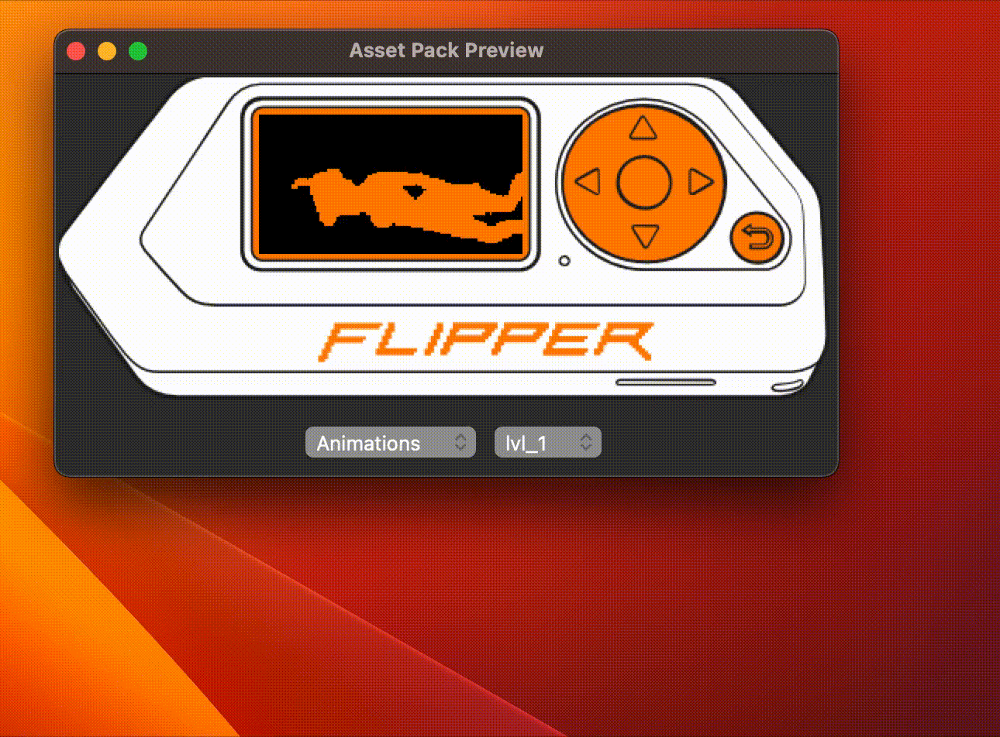

# Xtreme-Assetpack Previewer

Asset Pack Preview is a Python tool for previewing animations and icons in asset packs for the Xtreme firmware.

## Installation

1. Clone the repository: `git clone https://github.com/timstrasser/Flipper-Xtreme-Assetpack-Previewer.git`
2. Install the required packages: `pip install -r requirements.txt`

## Usage

1. Navigate to the root folder of an asset pack and copy the scripts into it.
2. Run the following command: `python main.py`
3. The Asset Pack Preview window will open.

## Features

- Preview animations and icons in asset packs.
- Automatically detect and load animations from the "Anims" folder.
- Load icons from the "Icons" folder and allow selection of specific icon files.

## More Information

For more information about asset packs for the Xtreme firmware, please see the [Flipper Xtreme Wiki](https://github.com/ClaraCrazy/Flipper-Xtreme/wiki/Asset-Packs). 
